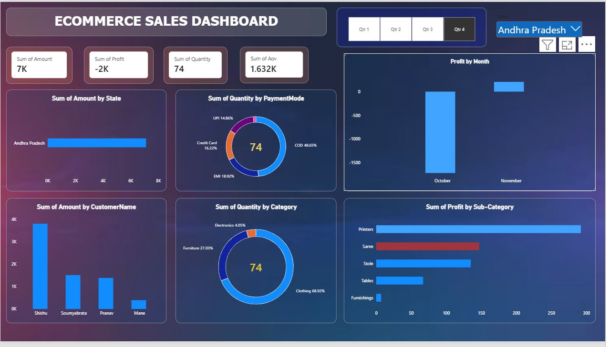
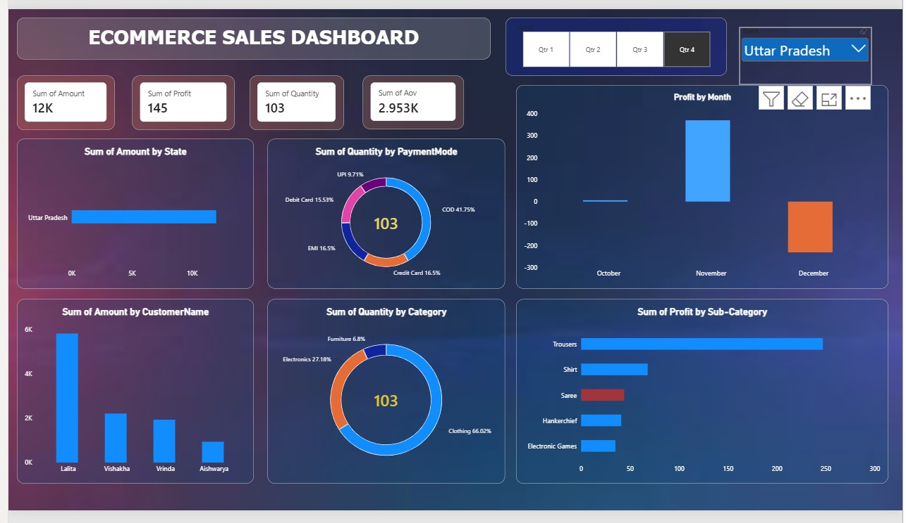

# 🛒 E-Commerce Sales Dashboard
E-Commerce Sales Dashboard using Power BI and Excel

## 📊 Project Overview

This is my first Data Analytics project, an E-Commerce Sales Dashboard created using Power BI and Excel.

The dashboard helps analyze sales performance and provides useful insights through interactive visualizations.

## 🛠️ Tools & Technologies

- Power BI
- Microsoft Excel
- Data Analysis
- Data Visualization

## 📈 Dashboard Features

- Total Sales Analysis
- Sales Performance Overview
- Interactive Charts and Visualizations
- Product and Sales Insights
- Business Performance Analysis

## 🖼️ Dashboard Preview

### Dashboard Screenshot 1

### Dashboard Screenshot 2

## 🎯 Key Learning

Through this project, I practiced:

- Data cleaning and preparation
- Data analysis
- Dashboard creation
- Data visualization
- Business insights generation

## 👨‍💻 Author

**Sachin**

B.Tech Computer Science & Engineering  
Delhi Institute of Engineering and Technology

### 🔗 GitHub

[Visit my GitHub Profile](https://github.com/sachin-cse07)
